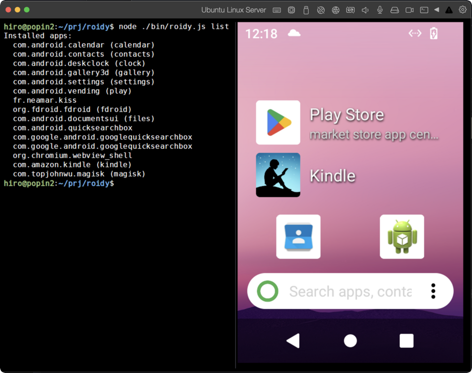
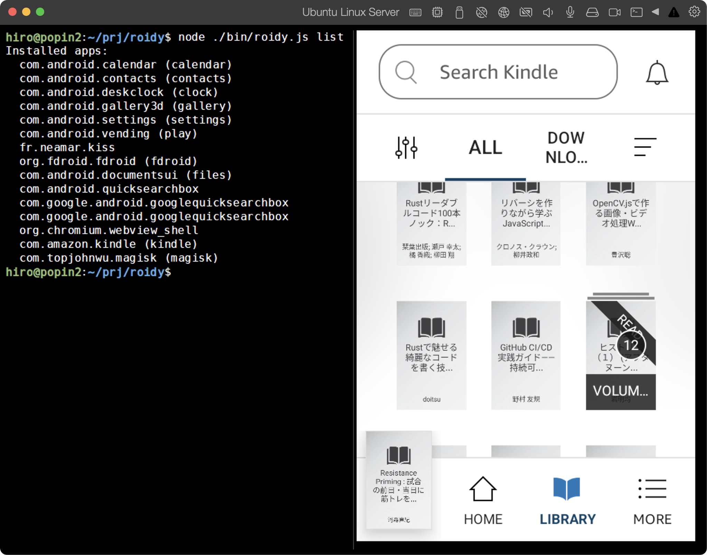

# roidy

[日本語版 / Japanese](README.ja.md)

Terminal-based adb frontend — view and control Android devices from your terminal using Kitty graphics protocol.

Each app runs in its own virtual display, so you can use multiple apps simultaneously in separate terminal windows.

<p align="center">
  <br />
  <em>Mirror Android home screen — running on Linux console (no X11/Wayland)</em>
</p>

<p align="center">
  <br />
  <em>Launch apps in their own virtual display — <code>roidy start kindle</code></em>
</p>

## Prerequisites

### Node.js

Node.js 18 or later.

### adb (Android Debug Bridge)

```bash
# macOS
brew install android-platform-tools

# Ubuntu / Debian
sudo apt install android-tools-adb

# Windows — download Android SDK Platform-Tools from developer.android.com
```

You need an Android environment accessible via adb. Any of the following will work:

- **Physical device** (USB connection)
- **Android Studio Emulator (AVD)**
- **Genymotion** or other third-party emulators
- **Redroid** (Docker-based headless Android)

For a fully headless setup, we recommend **Redroid** — that's what we use for development and testing.
Note that Redroid depends on the Linux kernel's binder driver, so it's **Linux only**.
See [examples/redroid-setup-12](examples/redroid-setup-12/) for our setup notes.

### Terminal

A terminal that supports the [Kitty graphics protocol](https://sw.kovidgoyal.net/kitty/graphics-protocol/):

- [Kitty](https://sw.kovidgoyal.net/kitty/)
- [Ghostty](https://ghostty.org/)
- [WezTerm](https://wezfurlong.org/wezterm/)

### ffmpeg (optional — for `roidy cast`)

Required only for `roidy cast` (low-latency streaming via scrcpy).

```bash
# macOS
brew install ffmpeg

# Ubuntu / Debian
sudo apt install ffmpeg

# Windows (winget)
winget install Gyan.FFmpeg
```

## Install

```bash
npm install -g @sanohiro/roidy
```

## Usage

```bash
# Mirror the entire Android screen
roidy

# Launch an app in its own virtual display
roidy start kindle
roidy start settings

# Low-latency streaming via scrcpy + ffmpeg
roidy cast
roidy cast kindle

# Specify host and port
roidy --host 192.168.1.100 --port 5555

# Change capture interval (ms)
roidy --interval 500
```

## Commands

```bash
roidy                    # Mirror Android screen (display 0)
roidy start <app>        # Launch app in virtual display
roidy cast [app]         # Low-latency streaming (scrcpy + ffmpeg)
roidy list               # List installed apps
roidy search <query>     # Search F-Droid for apps
roidy install <pkg|apk>  # Install from F-Droid or local APK
roidy update             # Update all apps via F-Droid
roidy uninstall <pkg>    # Uninstall an app (-y to skip confirmation)
roidy info               # Show device info
roidy screenshot [file]  # Save screenshot (alias: ss)
roidy restart            # Restart system UI (zygote)
roidy setup              # Interactive device setup
```

### roidy start

Launches an app in its own virtual display. Multiple apps can run simultaneously in separate terminal windows.

```bash
# Use short aliases
roidy start kindle
roidy start settings

# Use full package names
roidy start com.amazon.kindle

# Partial match
roidy start amazon

# Fallback to main display (if virtual display doesn't work)
roidy start kindle --display 0
```

### roidy cast

Low-latency streaming via scrcpy-server + ffmpeg. Requires `ffmpeg` installed on the host. scrcpy-server is automatically downloaded on first use.

```bash
# Mirror display 0
roidy cast

# Launch app and stream
roidy cast kindle

# Set max fps
roidy cast --fps 15

# Force JPEG output (bcon only — requires file transfer mode)
roidy cast --format jpeg
```

### roidy setup

Interactive setup for Android devices. Not required to use roidy, but recommended — configures timezone, locale, and other settings that make the device easier to use from a terminal.

```bash
# Interactive mode — walks you through each setting
roidy setup

# Non-interactive with flags
roidy setup -t Asia/Tokyo -l ja-JP --clock 24 --screen-timeout 0 --screen-lock off

# GApps: skip wizard and disable Play Protect
roidy setup --skip-wizard --disable-play-protect

# Skip app installation prompts
roidy setup -t Asia/Tokyo -l ja-JP --no-install
```

Setup options:
- GApps: setup wizard skip, Play Protect disable (auto-detected)
- Timezone, locale, clock format
- Screen timeout, screen lock
- Launcher (KISS Launcher, Discreet Launcher)
- F-Droid (open-source app store)

See [docs/setup.md](docs/setup.md) for details on each setting.

### roidy search / install / update

Manage apps via F-Droid without touching the screen.

```bash
# Search for apps
roidy search browser
roidy search keyboard

# Install from F-Droid
roidy install org.mozilla.fennec_fdroid

# Install local APK
roidy install ./app.apk

# Update all F-Droid apps
roidy update

# Uninstall
roidy uninstall fennec
```

## Key bindings

| Key | Action |
|-----|--------|
| Ctrl+Q | Quit |
| Escape | Android Back |
| Mouse click | Tap |
| Mouse long press | Long press (hold > 400ms) |
| Mouse drag | Swipe |
| Scroll wheel | Scroll |
| Arrow keys | D-pad |
| Text input | Text input (typed characters are sent to Android) |

## Config

Customize settings in `~/.roidy/config.json`:

```json
{
  "host": "localhost",
  "port": 5555,
  "interval": 1000
}
```

Key bindings can be customized in `~/.roidy/keys.json`.

## Redroid setup (Linux)

roidy works with any Android environment accessible via adb — physical devices, emulators, or containers. We use **Redroid** because we run on Linux without X11/Wayland, and Redroid is the only option that works in a fully headless (no GUI) environment.

Redroid requires the binder kernel module:

```bash
# Load the kernel module
sudo modprobe binder_linux

# Persist across reboots
echo "binder_linux" | sudo tee /etc/modules-load.d/redroid.conf

# Start Redroid container
docker run -d --name redroid --privileged --restart unless-stopped \
  -p 5555:5555 \
  redroid/redroid:12.0.0_64only-latest
```

### Google Play (GApps)

If you need apps that depend on Google Play Services (e.g. Kindle), use [redroid-script](https://github.com/ayasa520/redroid-script) to build a GApps-enabled image:

```bash
git clone https://github.com/ayasa520/redroid-script.git
cd redroid-script
python3 -m venv .venv && source .venv/bin/activate
pip install -r requirements.txt
python3 redroid.py -a 12.0.0_64only -mtg -m -c docker
```

Then start with the custom image:

```bash
docker run -d --name redroid --privileged --restart unless-stopped \
  -p 5555:5555 \
  redroid/redroid:12.0.0_64only_mindthegapps_magisk
```

For apps without Google Play dependencies, F-Droid is sufficient — install apps via `roidy install` without any screen interaction.

> **Note:** Some apps set `FLAG_SECURE` which makes screen capture return black frames. If you need these apps, a patch is available — see [examples/redroid-setup-12](examples/redroid-setup-12/) for details.

For a more detailed walkthrough of our setup process, see [examples/redroid-setup-12](examples/redroid-setup-12/).

## License

MIT
